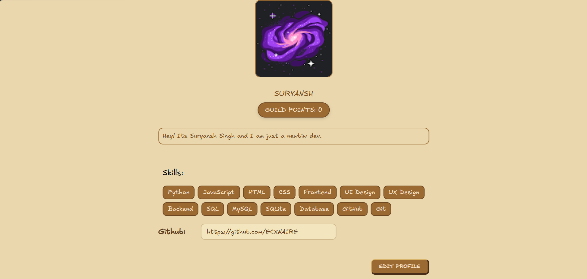
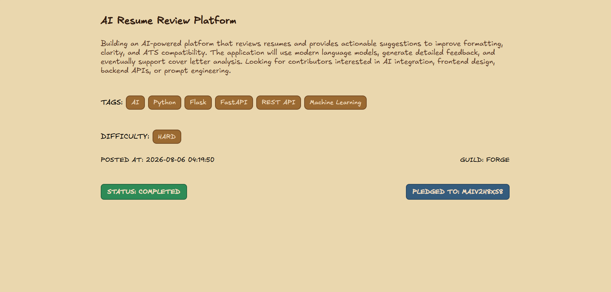
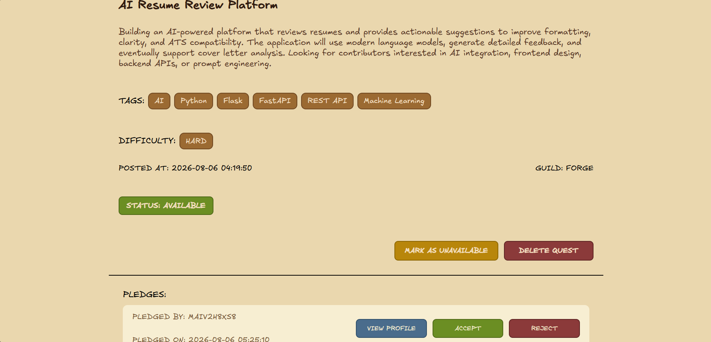
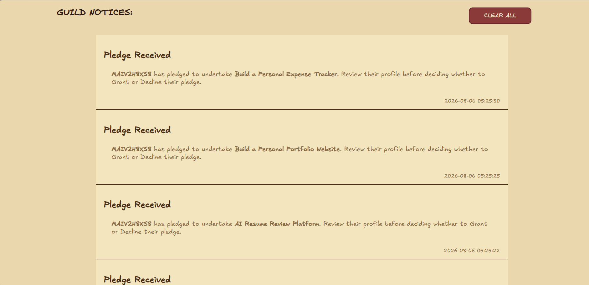

# GUILDHALL
GUILDHALL is a collaborative platform where users can post their projects as quests and pledge to work on them, build their profiles, earn Guild Points, and collaborate with others in a way that feels a little more fun than a traditional project board. 

The main reason to build GUILDHALL was to gamify the boring and repetitive process of project management. Instead of treating projects just like ordinary tasks on a checklist, I wanted them to feel like quests that they could take on and be rewarded for. My goal was to make collaboration more engaging while encouraging developers to build, learn and help each other along the way (although its not fully there yet T_T).

## FEATURES
- GOOGLE and GITHUB OAuth ( tried hackclub OAuth but I couldnt put my fingers on what's wrong )
- You can create and delete quests ( If you see this here, I havent added Edit quest yet )
- You can pledge to complete quests
- Guild Points reward system, based on on difficulty of the quest
- Notification system
- Users stats
- Skills tagging
- Interative quest board (you can pann infinitely and zoom)
- You can customise your profile

## WILL ADD SCREENSHOTS HERE 
### PROFILE PAGE

### QUEST COMPLETED PAGE

### QUEST PAGE

### NOTIFICATIONS PAGE

## TECH STACK

## FUTURE IMPROVEMENTS 
- Quest search and filtering
- Comments on quests
- Leaderboard
- Acheivement badges or smth like that

## CONTRIBUTING
Suggestions, bug reports, and pull requests are always welcome. Feels free to fork the project and experiment with new ideas.
